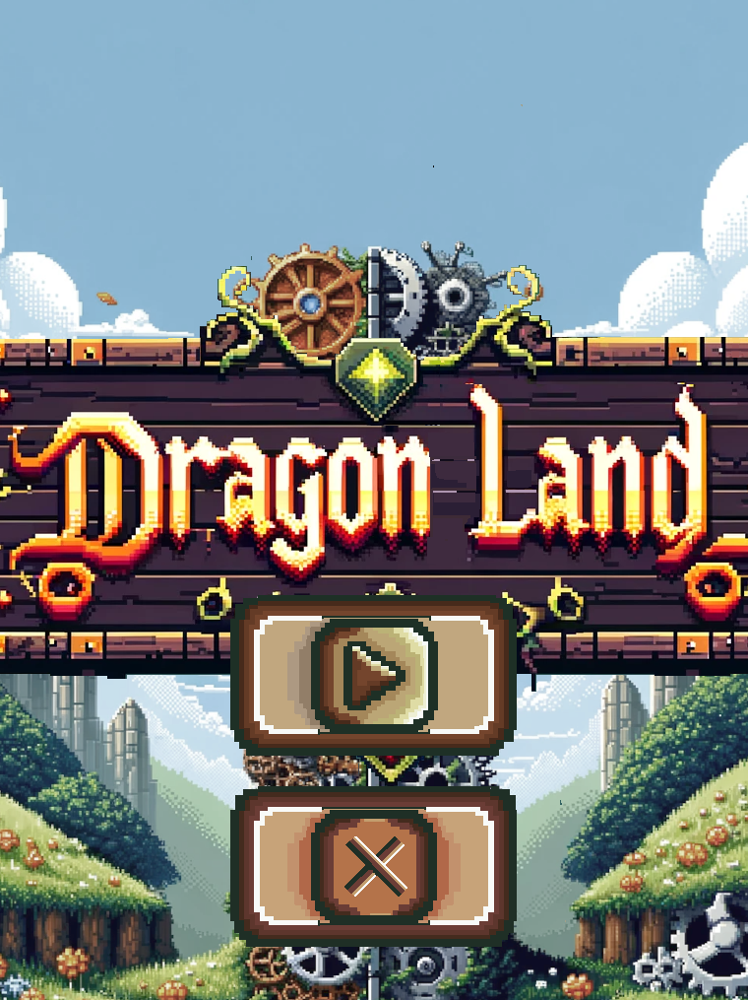
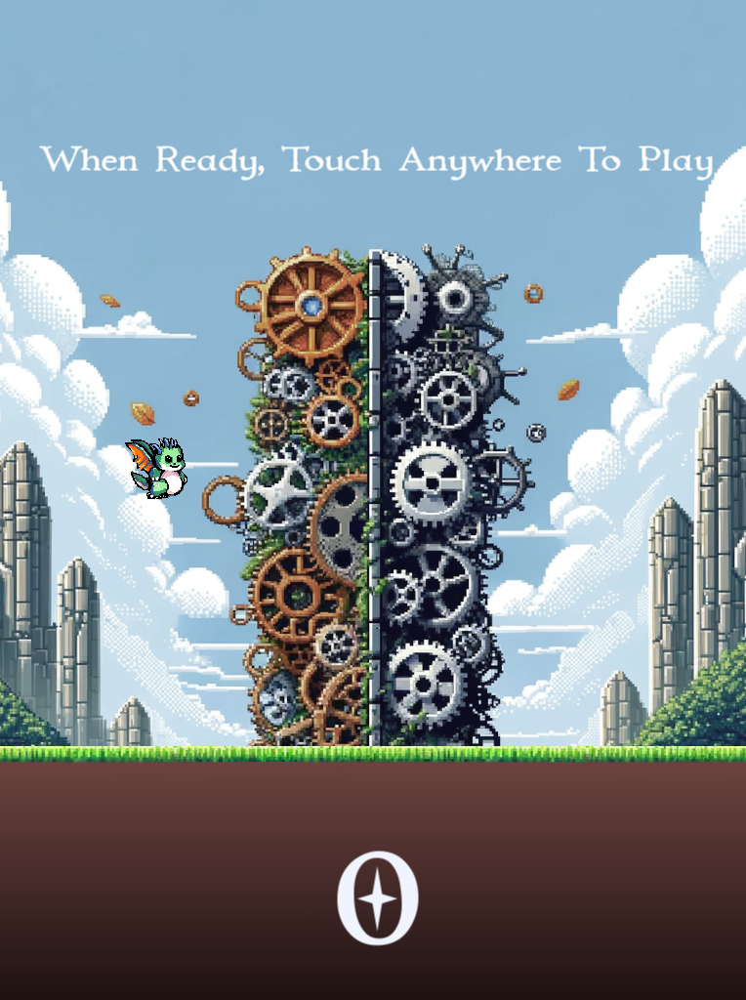
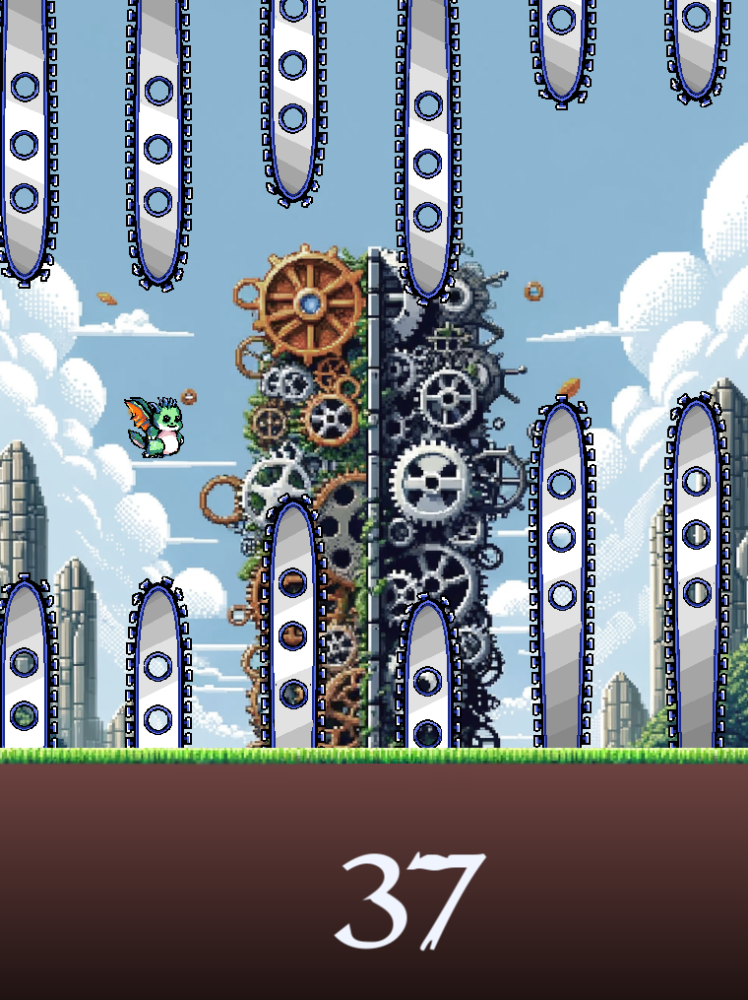
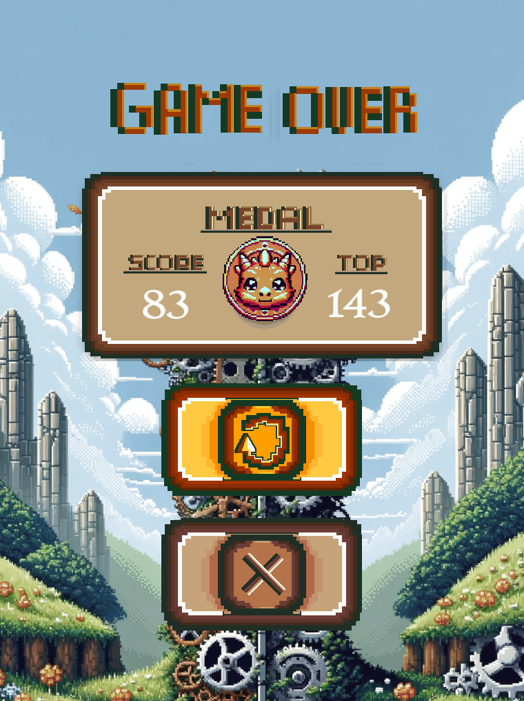

# Cpp-SFML_custom-GameEngine-with-DragonLand-game
#
 As a C++  project; I created a simple game engine that uses the SFML library, the engine handles assets, inputs, state machine, simple 2d graphics draws, and audio. The engine comes with a game that was built on top of it and has specific logic handled by the engine. The game is a take on the famous Flappy Bird but is rebuilt from scratch using C++ and my engine. All the Assets that are not audio are created by myself and are free to use, also the code is free to use, audio assets are NOT
#free to use as is and are under a CC BY-NC-ND license!  

If You Clone or Download WindowsBuild or UbuntuBuild directories copy the Assets from the SourceCode directory into them.

For successful compilation on LINUX-Ubuntu 22.04, you need to be sure to have installed GCC/G++ and SFML, if you do not have them here are steps to run in the terminal:  
            $ sudo apt update  
            $ sudo apt install gcc  
            $ sudo apt install build-essential  
            $ sudo apt-get install libsfml-dev  
          
Once you have all, to compile run the following terminal command inside your game dir:  
           $ g++ -o DragonLand AssetsControllerClass.cpp CollisionClass.cpp DragonClass.cpp FlashScreenClass.cpp Game.cpp GameOverStateClass.cpp GameStateClass.cpp HUDClass.cpp InputControllerClass.cpp LandClass.cpp main.cpp MainMenuStateClass.cpp SawClass.cpp SimpleClock.cpp SplashStateClass.cpp StateMachineClass.cpp -lsfml-graphics -lsfml-window -lsfml-system -lsfml-audio   
Then to run the game: 
  $ ./DragonLand 

For Windows 10 compilation I used CODE:BLocks and MinGW and SFML version 2.3.1-GCC 4.9.2 MinGW (SEH)-64-bit, you need to properly setup CODE:Block project such that the debugger has the right paths to the SMFL lib and include directories. You should have DragonLand.exe if done right. 

Game Screenshots:  

  

    

    

 
